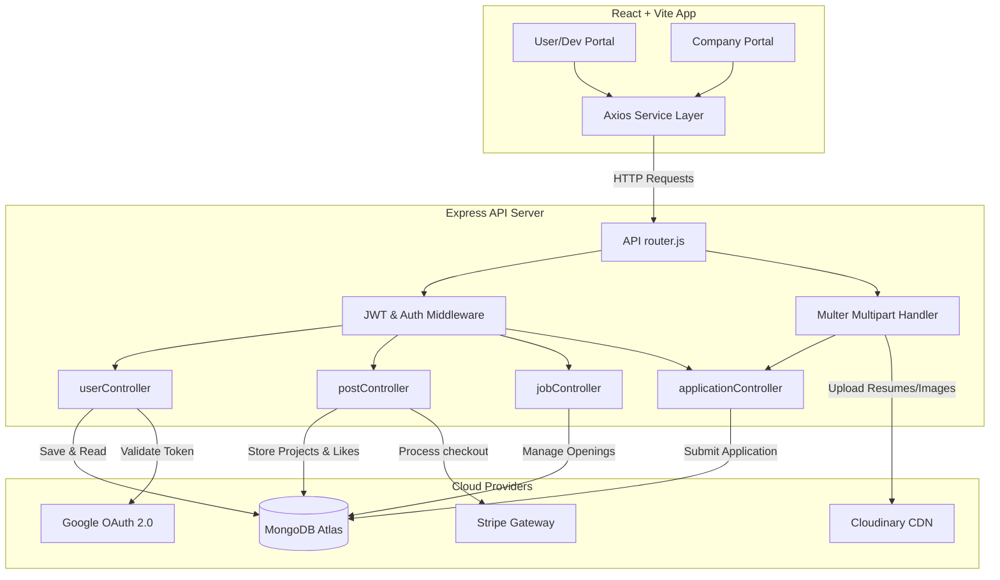
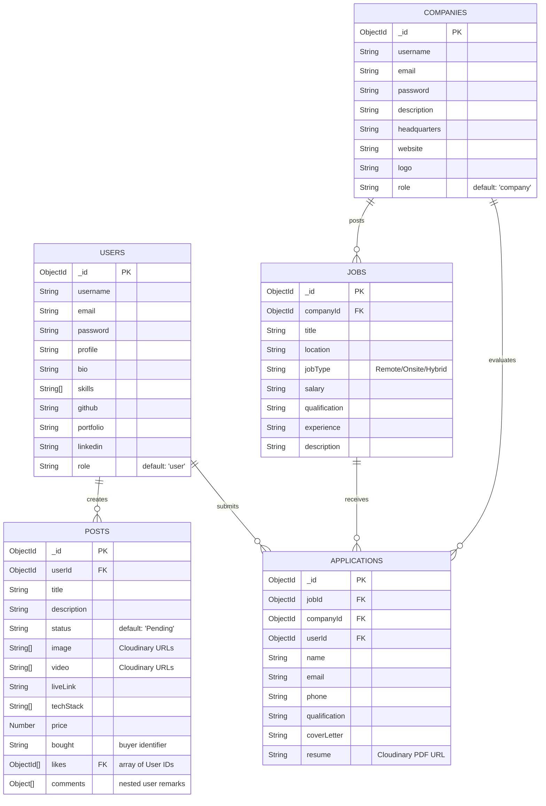
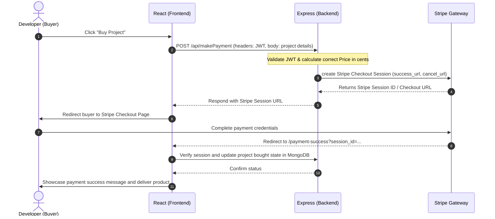

<<<<<<< HEAD
# DevConnect - Client (Frontend) 💻

> **Looking for the Server/API codebase?**  
> 🔗 **[Click here to view the Backend Repository](https://github.com/AbhinandRajeev/DevConnect_backend)** 
=======
# DevConnect 🚀
> **Showcase. Sell. Hire.**  
> A premium, modern marketplace and career hub tailored specifically for developers, freelancers, and tech creators to monetize their side-projects, build verified portfolios, and connect with prospective companies.
>>>>>>> fece5d0 (minor updates)

---

### 🔗 Repository Links
This project is divided into two separate repositories for the frontend client and the backend server:
* 💻 **[Frontend (UI) Repository](https://github.com/AbhinandRajeev/DevConnect_frontend)**
* ⚙️ **[Backend (API) Repository](https://github.com/AbhinandRajeev/DevConnect_backend)**

---

## 📖 Table of Contents
1. [Overview](#-overview)
2. [Key Features](#-key-features)
   - [For Developers](#-for-developers)
   - [For Companies](#-for-companies)
3. [Tech Stack](#-tech-stack)
4. [System Architecture](#%EF%B8%8F-system-architecture)
5. [Database Schema](#%EF%B8%8F-database-schema)
6. [Getting Started](#%EF%B8%8F-getting-started)
   - [Prerequisites](#prerequisites)
   - [Backend Setup](#backend-setup)
   - [Frontend Setup](#frontend-setup)
7. [API Endpoints](#-api-endpoints)
8. [Workflows](#%EF%B8%8F-workflows)
   - [Stripe Checkout Integration](#1-stripe-checkout-integration)
   - [Multer & Cloudinary Media Upload](#2-multer--cloudinary-media-upload)

---

## 🌟 Overview
**DevConnect** is a comprehensive full-stack ecosystem designed to bridge the gap between creative developer endeavors and commercial success. Rather than letting side-projects sit idle in public repositories, DevConnect empowers creators to publish their products in a curated marketplace. 

Developers can sell source codes, gather engagement via likes and comments, and compile a beautiful, unified developer profile. Concurrently, companies can create institutional profiles, explore the marketplace for software solutions, list active career vacancies, and directly recruit top talent through a streamlined applicant management portal.

---

## ✨ Key Features

### 💻 For Developers
* **Interactive Showcase**: Build a media-rich presentation of your software. Upload multiple project images, interactive walkthrough videos, and link source repositories alongside live demo links.
* **Unified Developer Profiles**: Highlight your professional persona with direct links to GitHub, LinkedIn, and personal portfolios, combined with custom profile pictures, biography, and skill sets.
* **Marketplace Monetization**: Sell your project licenses or complete source codes directly to other developers or organizations with secure checkouts.
* **Engagement Engine**: Give and receive feedback on projects with direct post liking and interactive comment sections.
* **Seamless Careers Portal**: Search through company-listed jobs and submit dynamic applications attaching structured cover letters and PDF resumes.

### 🏢 For Companies
* **Corporate Profiling**: Create a distinct brand presence on the hub, featuring headquarters information, website links, descriptions, and corporate logos.
* **Recruitment Hub**: Manage, post, and delete job opportunities specifying salaries, experience requirements, qualifications, and locations.
* **Applicant Review System**: View submitted developer applications, read personalized cover letters, and download candidate resumes directly to identify fits.

### 🔑 Shared Ecosystem Capabilities
* **Dual-Method Authentication**: Secure user and company accounts via custom JWT-based email/password registration or passwordless Google OAuth 2.0.
* **Responsive Fluid Design**: Tailored visual interface equipped with animations, interactive overlays, and seamless desktop-to-mobile navigation.

---

## 🛠 Tech Stack

### Frontend


* **Core Framework**: React 19 & Vite (for blazing fast build times and HMR)
* **Styling & Components**: Tailwind CSS v4, Flowbite React, and Material UI Icons
* **Routing**: React Router Dom v7
* **API Client**: Axios (configured with common interceptors)
* **UI Feedback**: React Toastify (for notifications and form validation alerts)

### Backend & Cloud Services


* **Runtime & Framework**: Node.js & Express
* **Database**: MongoDB Atlas with Mongoose ODM
* **Authentication**: JSON Web Tokens (JWT) & Google OAuth
* **Storage**: Cloudinary API (via `multer` and `multer-storage-cloudinary` for static file uploads)
* **Payments**: Stripe Node SDK & Stripe Checkout Elements

---

## 🗺️ System Architecture



---

## 🗄️ Database Schema

Here is a simplified outline of the core database collections managed in MongoDB Atlas:



---

## ⚙️ Getting Started

### Prerequisites
* [Node.js](https://nodejs.org/en/) installed locally (v18+ recommended)
* A [MongoDB Atlas](https://www.mongodb.com/cloud/atlas) account and database instance
* A [Stripe Developer](https://stripe.com) account for payment credentials
* A [Cloudinary](https://cloudinary.com) account for media asset storage
* A [Google Cloud Console](https://console.cloud.google.com) project configured for Google OAuth 2.0 Client credentials

---

### Backend Setup

1. Navigate to the backend directory:
   ```bash
   cd dc_backend
   ```
2. Install dependencies:
   ```bash
   npm install
   ```
3. Create a `.env` file in the root of `dc_backend/` and supply the configuration:
   ```env
   # Database connection
   connectionString=mongodb+srv://<username>:<password>@cluster.mongodb.net/<database_name>?retryWrites=true&w=majority
   
   # JWT secret signing key
   jwtKey=your_jwt_signing_key_here
   
   # Stripe payment secret gateway key
   stripeKey=sk_test_...
   
   # Cloudinary storage configurations
   CLOUDINARY_CLOUD_NAME=your_cloudinary_cloud_name
   CLOUDINARY_API_KEY=your_cloudinary_api_key
   CLOUDINARY_API_SECRET=your_cloudinary_api_secret
   ```
4. Start the backend developer server:
   ```bash
   # Runs express on port 3000 using nodemon
   npm run dev
   ```

---

### Frontend Setup

1. Navigate to the frontend directory:
   ```bash
   cd ../dc_frontend
   ```
2. Install dependencies:
   ```bash
   npm install
   ```
3. Configure your Google Client ID for OAuth inside your layout/main components where `@react-oauth/google` provider is integrated.
4. Set up the target backend endpoint in `dc_frontend/src/services/serverURL.js`:
   ```javascript
   // Toggle comments depending on local development or cloud deployment
   export const serverURL = "http://localhost:3000"
   // export const serverURL = "https://your-deployed-backend.onrender.com"
   ```
5. Run the frontend development server:
   ```bash
   # Starts Vite server and triggers standard browser opening
   npm run dev
   ```

---

## 🔌 API Endpoints

### 🔐 Authentication & User Profiles
| Method | Endpoint | Description | Auth Requirement |
| :--- | :--- | :--- | :--- |
| `POST` | `/api/register` | Register a new Developer / Company user | None |
| `POST` | `/api/login` | Email/Password login verification | None |
| `POST` | `/api/google-auth` | Verify and sign in via Google OAuth payload | None |
| `GET` | `/api/user/:id` | Retrieve developer profile data | `JWT Middleware` |
| `PUT` | `/api/updateProfile` | Modify profile picture, details, and social links | `JWT Middleware + Multer` |

### 🛒 Projects & Marketplace
| Method | Endpoint | Description | Auth Requirement |
| :--- | :--- | :--- | :--- |
| `POST` | `/api/addPost` | Upload a new marketplace project with images/videos | `JWT Middleware + Multi-Multer` |
| `GET` | `/api/allPosts` | Fetch and query all active projects (supports query `?search=`) | `JWT Middleware` |
| `GET` | `/api/profilePost` | Fetch projects created specifically by the logged-in user | `JWT Middleware` |
| `GET` | `/api/projectDetails/:id` | Fetch comprehensive detail of a specific project | `JWT Middleware` |
| `POST` | `/api/likepost/:id` | Like or unlike a project post | `JWT Middleware` |
| `POST` | `/api/comment/:id` | Submit a comment to a project | `JWT Middleware` |
| `POST` | `/api/makePayment` | Handle project purchases and initiate Stripe Checkout sessions | `JWT Middleware` |

### 💼 Jobs & Applications
| Method | Endpoint | Description | Auth Requirement |
| :--- | :--- | :--- | :--- |
| `POST` | `/api/addJob` | Post a new job opening (Company only) | `JWT Middleware` |
| `GET` | `/api/allJobs` | Get and search all active job openings (supports `?search=`) | `JWT Middleware` |
| `GET` | `/api/companyJobs` | Get all job opportunities listed by the signed-in company | `JWT Middleware` |
| `DELETE` | `/api/deleteJob/:id` | Terminate/delete a specific job posting | `JWT Middleware` |
| `POST` | `/api/applyJob` | Submit a job application with cover letters and resume PDFs | `JWT Middleware + Resume Multer` |
| `GET` | `/api/companyapplications` | Retrieve all applications submitted to the company's postings | `JWT Middleware` |
| `GET` | `/api/userapplications` | Retrieve all job applications submitted by the logged-in user | `JWT Middleware` |

---

## ⚙️ Workflows

### 1. Stripe Checkout Integration


### 2. Multer & Cloudinary Media Upload
All project snapshots, demonstration videos, profile images, and PDF resumes are stored directly in **Cloudinary CDN** using a streamlined Express stream parser:

```
[ Frontend Multipart/Form-Data ]
            │
            ▼
[ Multer Middleware (RAM Stream) ]
            │
            ▼
[ Multer-Storage-Cloudinary ]
            │
            ▼
[ Cloudinary API Gateway ] ──────► (Saves media securely)
            │
            ▼
[ Cloudinary Returns Asset URL ]
            │
            ▼
[ Express Saves String URL in MongoDB ]
```

---

## 👥 Authors & Contributors
* Developed as a comprehensive React and MERN integration project.
* Crafted with a clean, high-performance UI using premium layout components and custom animation elements.

---
